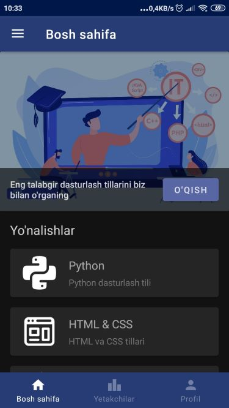
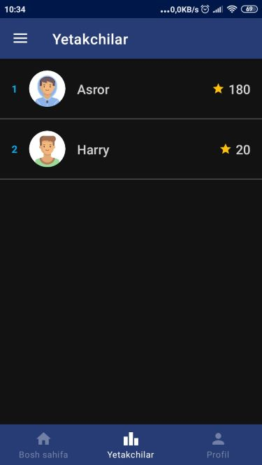
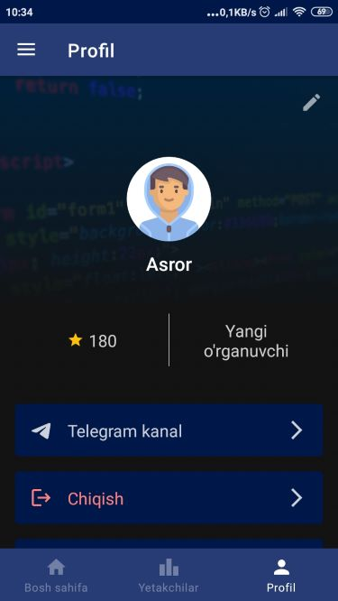
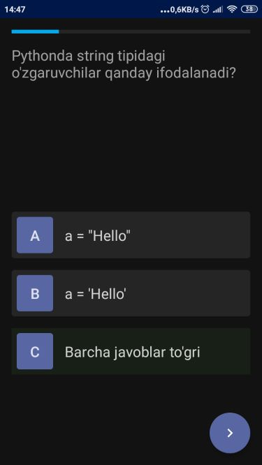
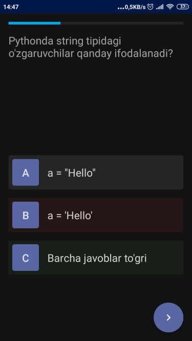
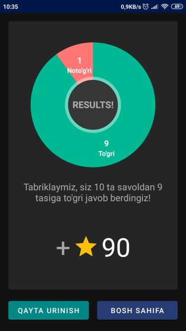

## Codearn

### Learn programming with us!

Codearn is an app to learn programming anywhere, anytime. It also has Leaderboard, which shows the top 20 users. It helps to build competition among users.

Technologies used:

  
  
  
  
  
  
  

### Screenshots

|  |  |  |
| --- | --- | --- |
|  |  |  |

*Currently, app supports only Uzbek language.*
