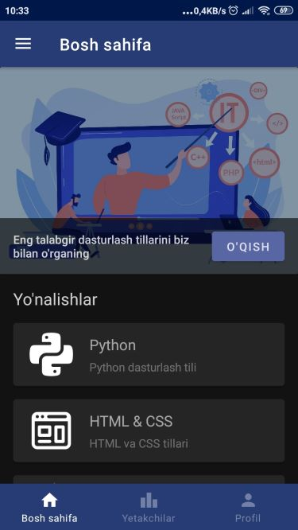
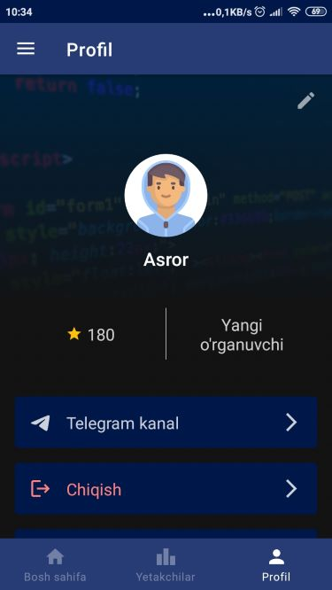
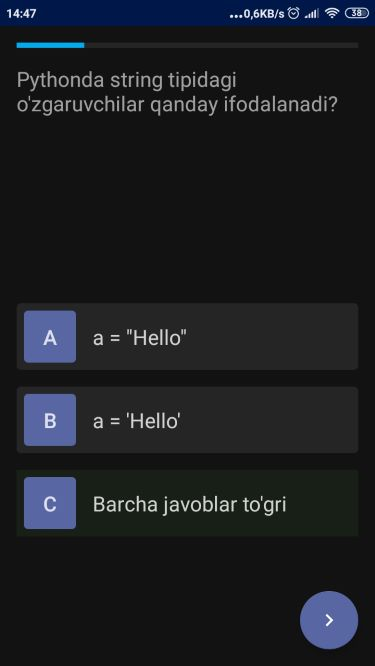
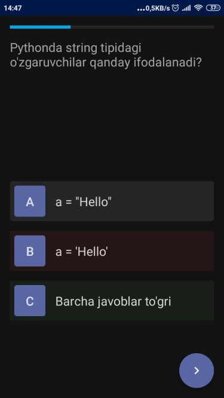
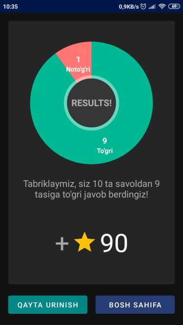

## Codearn

### Learn programming with us!

With this app you can learn programming anywhere anytime. App teaches more than five programming language. It also have Leaderboard, which shows top 20 user. It helps to build competetion among users.

Built with MVVM architecture.

Used:
- Cloud Firestore to save and retrieve data.
- Kotlin coroutines to write asynchronous, non-blocking code.
- Room
- Picasso library
- MPAndroidChart library

|  |  |  |  |  | 
| --------------------------- | ------------------------- | ------------------------- | ------------------------- | ------------------------- | ------------------------- |

---------------------

*Currently, app supports only Uzbek language.*
